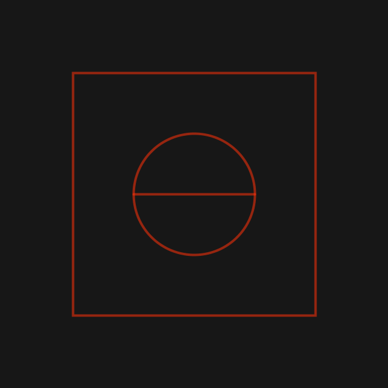
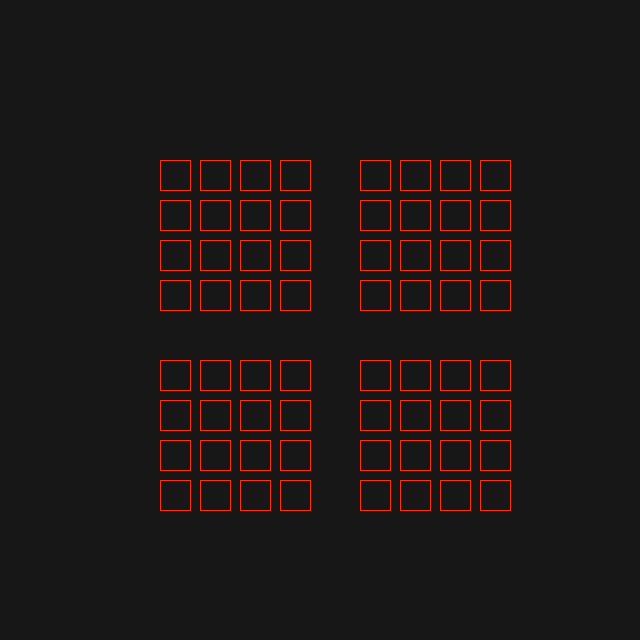
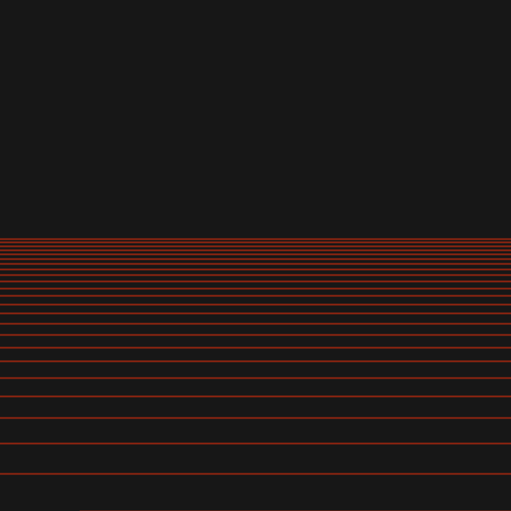
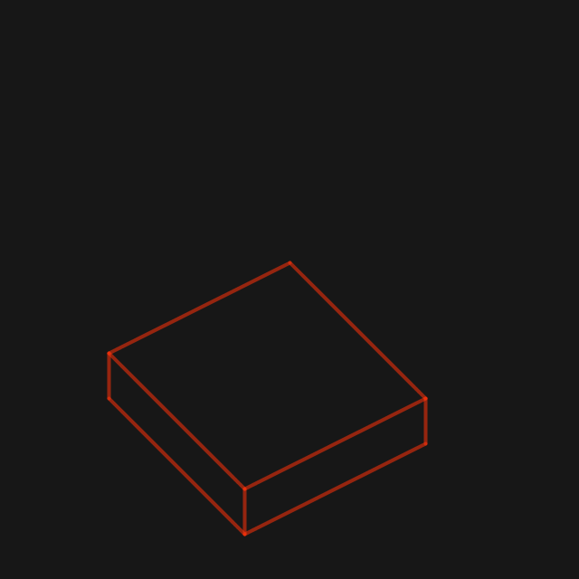
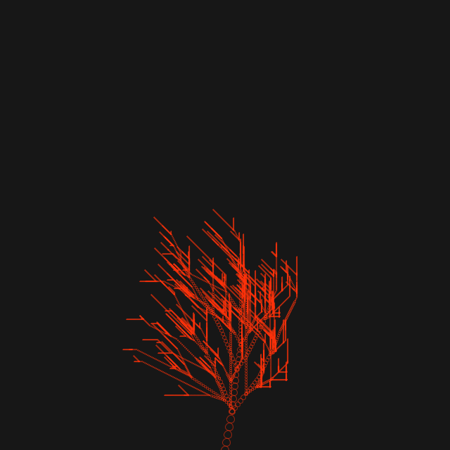
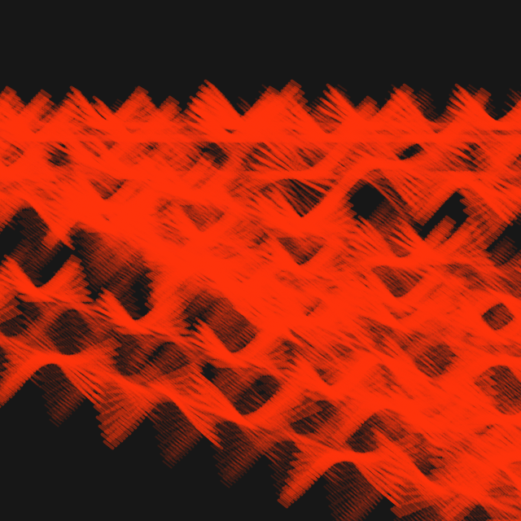
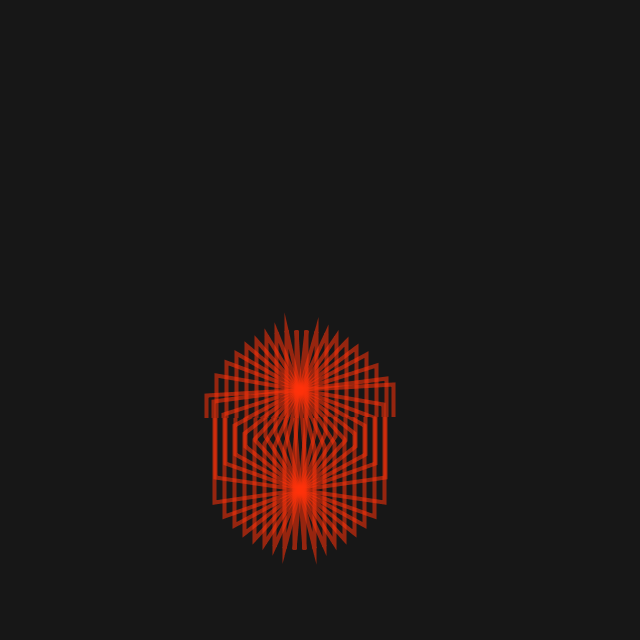
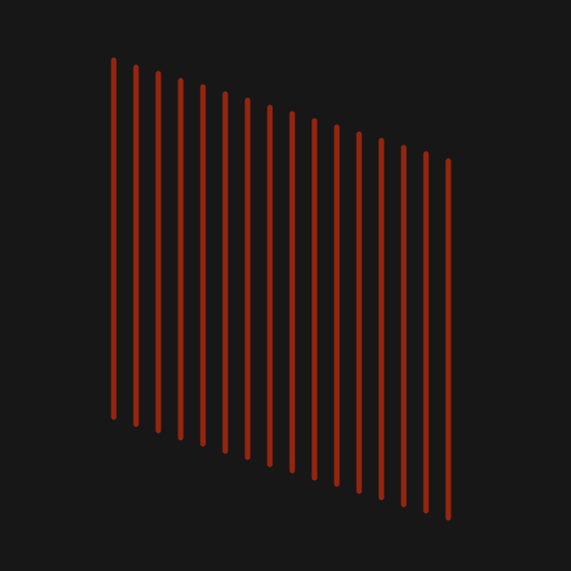
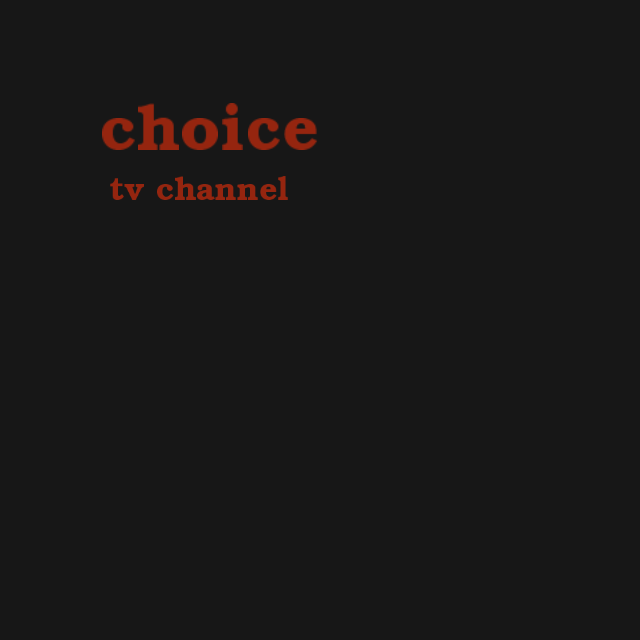

---
title: "Código para arte computacional"
subtitle: "Operaciones básicas"
author: [Ricardo Arellano]
date: "2019"
titlepage: true
toc-title: Contenidos
...

\pagebreak

Este catálogo pretende recopilar código útil para enseñanza y dirección de futuros trabajos en arte computacional. El objetivo es mostrar cada forma en base a sus operaciones, acompañadas del código fuente para **[Processing](https://processing.org)**.

\pagebreak

# Formas básicas

    int  center_x = width/2; int  center_y = height/2;
    int  size = 200;

    ellipseMode(CENTER);
    ellipse(center_x, center_y, size,size);
    line(center_x - size/2, center_y, center_x + size/2, center_y); rectMode(CENTER);
    rect(center_x,center_y, size * 2,size * 2 );

    //OOP

    Same cuadrado = new Same(center_x, center_y, size * 4, "quad"); Same circulo = new Same(center_x, center_y, size, "circle");

    Same linea= new Same(center_x, center_y, size * 4, "linea_horizontal");
    cuadrado.display(); circulo.display(); linea.display();
    }

    class Same {
        int x;
        int y;
        int siz; String tipo;

        Same(int x_, int y_, int size, String type) {
        x = x_;
        y = y_;
        siz = size; tipo = type;
        }

        void display() {
            if (tipo== "quad") {
            rectMode(CENTER); rect(x,y, siz,siz);
            } else if (tipo == "circle") {
            ellipseMode(CENTER); ellipse(x, y, siz,siz);
            } else if (tipo == "linea_horizontal") { line(x - siz/2, y, x + siz/2, y);
            } else {
            strokeWeight(3); point(x,y);
            }
            } }

\pagebreak

# Grillas

    int real_cant = 8;
    int cant = real_cant /2;
    s = 30;
    sep = s + 10;
     for (int i=0; i< cant; i++) {
       for(int j=0; j < cant; j++) {
         rect(width/2 + sep + i * (sep * (sep/s)), height/2 + sep + j * (sep * (sep/s)), s,s);
         rect(width/2 - sep - i * (sep * (sep/s)), height/2 + sep + j * (sep * (sep/s)), s,s);
         rect(width/2 - sep - i * (sep * (sep/s)), height/2 - sep - j * (sep * (sep/s)), s,s);
         rect(width/2 + sep + i * (sep * (sep/s)), height/2 - sep - j * (sep * (sep/s)), s,s);
    } }

# Repetición

    int end_line = 800;
    int dist_observador_del_plano = 282;
    int obsx = end_line + dist_observador_del_plano;
    int obsy = 202;
    int step = 30;
    int vertical_x = 800;
    int altura = 480;

    //line(obsx -2, obsy-2, obsx +3, obsy+3);
    //line(obsx-2, obsy + 3, obsx+3, obsy-2);

    int baseline_y = height - altura;
      strokeWeight(2);
      line(end_line, baseline_y + altura, 100, baseline_y + altura);
      int distance = (vertical_x-100)/ step;
      float op_acumulator = 0;
      for(int i=0; i<distance; i++) {
        // marcas
        //line(100 + i* step, 200 + altura, 100 + i *step, 205 + altura);
        //lineas proyeccion
        //line(100 + i* step, 200 + altura, obsx, obsy);
        //soh cah toa
        float ad = dist_observador_del_plano + (step * (distance -i));
        float op = altura;
        float ang = tan(op / ad);
        float ad_small = (step * (distance -i));
        float op_small = ad_small * abs(atan(ang));
        //println(op_small);
        line(0,baseline_y + altura - op_small,width,  baseline_y + altura - op_small);
    } }

# Isométrico

    int nx = 100;
    int ny = 100;
    int z = 50;
    int posx =width/2 - nx/2;
    int posy = height - 100;
    //baseline
    int x = -nx;
    int x2 = x*2;
    int y = -ny - (ny / 2);
    line(y+posx,y+posy, posx,posy);
    line(posx,posy, -x2+posx,x+posy);
    line(y+posx,y+posy,-x2+y+posx,x+y+posy);
    line(-x2+y+posx,x+y+posy,-x2+posx,x+posy);
    //abajo
    line(y+posx,y+posy+z, posx,posy+z);
    line(posx,posy+z, -x2+posx,x+posy+z);
    //verticales
    line(y+posx,y+posy, y+posx,y+posy+z);
    line(posx, posy, posx, posy+z);
    line(-x2+posx,x+posy, -x2+posx,x+posy+z);

# Recursivo

    int tPunto =11;
    float direccionC ;
    float direccionP;
    int snap ;
    direccionC = 0.004;
    direccionP = radians(30);
    snap = 0;
    semilla(tPunto,250, width/2, height);
   
    void semilla(float tPunto, float angulo, float x, float y) {
    if (tPunto > 0.5) {
       float r = random(1.0);
       if (r > 0.03 && r < 0.1 ){
       ellipse(x,y, tPunto, tPunto);
       int nuevox = int(x + cos(angulo) * tPunto);
       int nuevoy = int(y + sin(angulo) * tPunto);
       semilla(tPunto * 0.8, angulo - direccionC, nuevox, nuevoy);
       semilla(tPunto * 0.6, angulo - direccionP, nuevox, nuevoy);
       semilla(tPunto * 0.6, angulo + direccionP, nuevox, nuevoy);
       }
       else if (r> 0.03) {
       //point(x,y);
       ellipse(x,y, tPunto, tPunto);
       int nuevox = int(x + cos(angulo) * tPunto);
       int nuevoy = int(y + sin(angulo) * tPunto) ;
       semilla(tPunto * 0.99, angulo - direccionC, nuevox, nuevoy);
        } else {
       ellipse(x,y, tPunto, tPunto);
       int nuevox = int(x + cos(angulo) * tPunto);
       int nuevoy = int(y + sin(angulo) * tPunto);
       semilla(tPunto * 0.8, angulo - direccionC, nuevox, nuevoy);
       semilla(tPunto * 0.6, angulo - direccionP, nuevox, nuevoy);
    }
    } }

# Trazado

    int num = 0;
    int dir = 2;
    int cant = 12;
    int step = 0;
    Wing[] pajaros;

    pajaros = new Wing[cant];
     for (int i=0; i<cant; i++) {
       int rand_x = int (random(-600, 300));
       int rand_y = int (random(150, 300));
       int rand_size = int (random(12, 16));
       pajaros[i] = new Wing(rand_x, rand_y, rand_size);
     }

    void draw() {
     for (int i=0; i<cant; i++) {
       pajaros[i].snapshot();
       pajaros[i].fly();
       pajaros[i].flyaway();
       pajaros[i].display();
    } }

    class Wing {
          int randStroke = 0;
          int r = int(random(200, 255));
          int g = int(random(200, 255));
          int b = int(random(30, 255));
          int posx;
          int posy;
          float size;
          int num = int(random(-size/2, size/2));
          int dir = 1;
          float dir_flyaway_x = random(2, 5);
          float dir_flyaway_y = random(0, 2);
          Wing(int posx_, int posy_, int size_) {
            posx = posx_;
            posy = posy_;
            size = size_;
        }
          void fly() {
            num = num + dir;
          if ( num >= size/3 || num <= -size/3) {
               dir = dir * -1;
        } }
        
            void flyaway() {
            posx = round(posx + dir_flyaway_x);
            posy = round(posy + dir_flyaway_y);
            size = size + 0.01;
          }
          void display() {
              for (int i=0; i< size; i++) {
              int r = 90 ;
              float h = 0.75;
              float ang = asin(h / r) * i * num;
              int m = int(atan(ang) * r) ;
              line(posx - 10- i * size/5,posy - m,posx - i * size/5, posy + size/2 - m);
              line(posx - 10 +size + i * size/ 5,posy - m,posx + size + i * size/5, posy + size/2 - m);
         } }

        void snapshot() {
             randStroke = randStroke + 1;
          if (randStroke % 40 == 2 ) {
          //stroke(r, g, b, 220);
          stroke(255, 50, 10, 100);
          strokeWeight(4);
        }

# Imágen

    PImage img;
    img = loadImage("image.jpg");
    int x=0;
    int y=0;
    int scale = 8;
    for(int j=0; j<height/(2*scale); j++) {
      y = j*2*scale;
     for(int i=0; i<width/(2*scale)+2*scale; i++) {
    x = (i*2*scale)-2*scale;
    int loc = x + 2*scale + y * img.width;
    float r = red(img.pixels[loc]);
    float g = green(img.pixels[loc]);
    float b = blue(img.pixels[loc]);
    // fill(r g,b);
    //stroke(r,g,b);
     beginShape();
      vertex(x,y);
      vertex(2*scale+x,y);
      vertex(2*scale+x,1*scale+y);
      vertex(3*scale+x,1*scale+y);
      vertex(3*scale+x,2*scale+y);
      vertex(1*scale+x,2*scale+y);
      vertex(1*scale+x,1*scale+y);
      vertex(x,1*scale+y);
      endShape(CLOSE);
    } }
    }

# Ciclo

    float n = 0;
    float aumento = 0.1;
    float base_left = 100;
    float base_right = 100;
    void setup() {
      size(640,640);
      background(23);
      noFill();
    //fill(255, 50, 10, 140);
      stroke(255, 50, 10, 140);
    strokeWeight(4);
      frameRate(12);
    }
    void draw() {
      background(23);
      base_left = base_left  - aumento;
      base_right = base_right + aumento;
     for (float i=- base_left; i < base_right; i+= 1) {
        float altura = 10 * i;
        float radio = 100 + n;
        float ang = asin(altura / radio);
        float x = cos(ang) * radio;
        int posy = 350;
        int posx = 300;
        // restriccion angulos NaN y excesivos
        if ((ang > 0 || ang < 0) && (ang >= - 1.05 && ang <= 1.25 )) {
      beginShape();
        vertex(posx + (10 * i) , posy + x);
        vertex(posx + (10 * i) , posy + x + 100);
        vertex(posx + (10 * -i) , posy + 80 - x + 100);
        vertex(posx + (10 * -i) , posy + 80 - x);
        endShape(CLOSE);
    } }
    }

# Seguir dirección 

    float x = 2.0;
    float y = 120.0;
    float separacion_x = 25.0;
    int limite = 400;
    int px = 100;
    int altura = 400;
    float desplazamiento_y = 15.0;
    void draw() {
     if ( x >= limite ) {
     x = limite;
    } else {
       x = x + separacion_x ;
       y = y + desplazamiento_y;
       line(px + x ,y/2.0 , px + x , altura +
    y/2.0 );
    }
    }

# Fuentes

    PFont font;
    font = loadFont("URWBookmanL-DemiBold-48.vlw");
    //String[] fontList = PFont.list();
    //println(fontList);
    textFont(font, 64);
    text("choice", 100, 150);
    textFont(font,32);
    text("life is", 110, 200);

